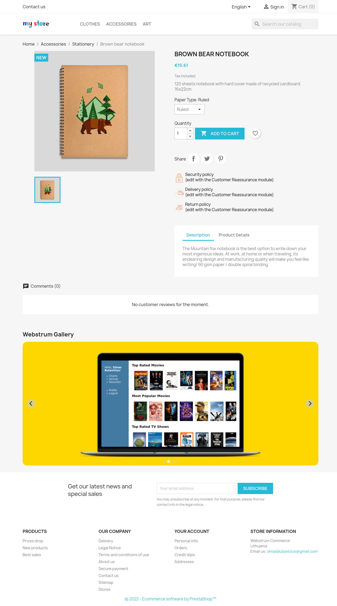
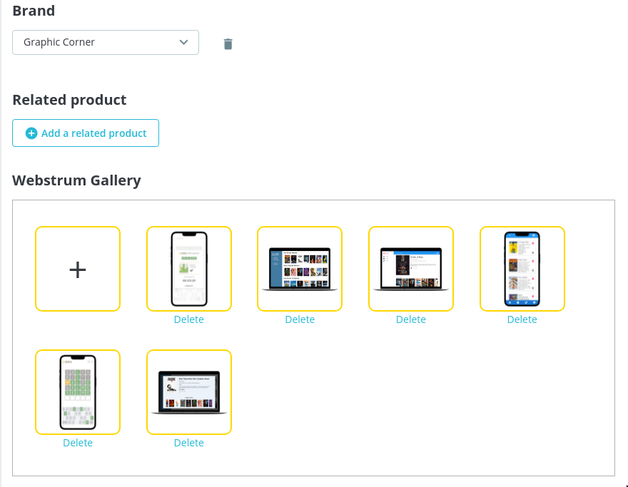
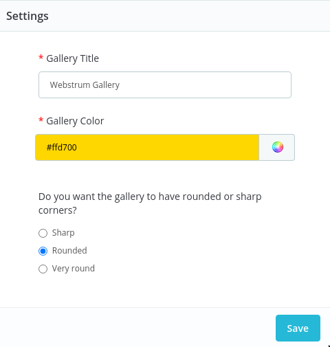

# Webstrum Gallery

This PrestaShop module adds an image gallery (in addition to the main one) to the bottom of product page.

## Features:
* Slider-type gallery. You can click on arrows or swipe through images.
* Drag-and-drop uploaded images around to reorder them.
* Customizable style.



## Requirements:
Prestashop 1.7.7+

## Installation:
1) Clone repository:
```
cd /path/to/prestashop/modules;
git clone https://github.com/butavicius/webstrumgallery.git;
```
2) Go to prestashop Back Office->Modules->Module Catalog, search for "Webstrum Gallery". 
3) Click "Install".

## Usage:

### Upload and arrange images in Back Office product page:



### Configure gallery to suit your theme:
In Back Office->Modules->Module manager, search for "Webstrum Gallery" and click "Configure".
* Change Gallery's title. 
* Pick gallery background color.
* Choose style - sharp or round gallery element corners. 



## Dev notes / TODO's:
* Really needs unit/controller integration tests (PHPUnit).
* Needs refactoring, see `// TODO:` comments.
* Could use improved PHPDoc documentation
* Could use checking against and aligning to PrestaShop code standards.
* Could use static analysis (PHPStan).

## Feature ideas:
* Some additional themes/variants.
* More sophisticated image optimisation.
